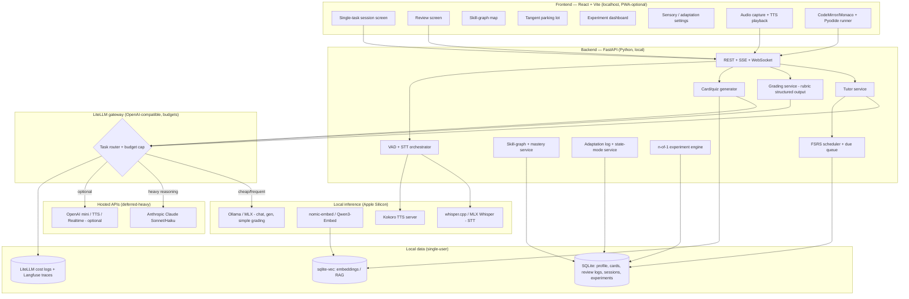

# Phase-1 Architecture: A Local-First, AuDHD-Centered AI Learning Platform

## TL;DR
- **Build a localhost web app (React + Vite frontend, FastAPI backend) on your M4 Pro, with a LiteLLM gateway routing cheap/frequent tasks to a local MLX or Ollama model and heavy tutoring/code-review to Anthropic Claude via API. Voice stays local: MLX/whisper.cpp STT → streaming LLM → Kokoro TTS.** This is cheap (~$8–25/month in API), private, and fast enough for interactive tutoring.
- **The heart of the system is a skill graph + FSRS spaced-repetition engine + LLM-graded testing**, wrapped in AuDHD-honoring UX: learner-selectable state modes, single-task screens, explained/reversible adaptations, a tangent parking lot, opt-in-only game mechanics, and a built-in n-of-1 experiment module.
- **Defer cloud, Electron/Tauri packaging, and heavy orchestration frameworks.** Use plain Python + Pydantic/PydanticAI + Instructor for structured output, SQLite (+ sqlite-vec) for all data and RAG, and Langfuse self-hosted for cost/quality logging. These choices keep phase-1 simple for a solo developer and don't box you into a cloud migration later.

---

## Key Findings

### Local runtime: MLX is fastest, Ollama is easiest; run both
On Apple Silicon, Apple's MLX framework is now the throughput leader. Per yage.ai's March 2026 analysis, *"At WWDC 2025, Apple established MLX as the preferred framework for LLM inference on Apple Silicon through three dedicated sessions,"* alongside a Foundation Models Swift framework calling an on-device ~3B model. Ollama shipped an MLX backend in v0.19 (March 30, 2026), roughly doubling decode speed on the same hardware. For a solo developer, **Ollama (llama.cpp or MLX backend) is the pragmatic default** because it ships a mature OpenAI-compatible HTTP server that every client library already speaks; **MLX / mlx-lm is the performance option** and the right choice for Whisper and Kokoro. LM Studio is a good GUI convenience but adds overhead. The honest conclusion from practitioners is not either/or — run Ollama as your always-on OpenAI-compatible endpoint and reach for MLX for voice models and any latency-critical path.

Critically for a 48 GB M4 Pro: **decode speed is memory-bandwidth-bound**, and (per Apple's own specs) the M4 Pro supports 273 GB/s of memory bandwidth, versus the M4 Max at 410 GB/s (14-core/32-core GPU) and 546 GB/s (16-core/40-core GPU). Published "M4" benchmark numbers that are actually M4 Max therefore do **not** apply to you.

### Realistic throughput on your M4 Pro (48 GB)
Directly measured community figures (Ollama, Q4_K_M): Llama 3.1 8B ≈ 34 tok/s; Qwen 2.5 32B and Qwen 2.5 Coder 32B ≈ 11 tok/s; Llama 3.1 70B ≈ 5 tok/s (slow but usable for batch). A 14B-class dense model (Gemma 3 12B, Qwen3 14B, Phi-4) at Q4 realistically lands around **18–24 tok/s** — this is *interpolated* (plain M4 measures ~12 tok/s on Qwen 2.5 14B; M4 Pro has ~40% more bandwidth), not directly measured, so validate on your machine. **MoE models are dramatically faster:** per yage.ai citing r/LocalLLM benchmarks, *"On a Mac mini M4 Pro (64GB) running Qwen3-Coder-30B-A3B (an MoE architecture), MLX achieved approximately 130 tok/s, compared to 43 tok/s for Ollama with the llama.cpp backend"* — because only ~3B parameters are active per token. Anything above ~10 tok/s reads faster than most people, so all of these are interactive-usable. Practical implication: prefer a fast 7–14B dense model or a 30B-A3B MoE for local chat; reserve the 32B dense coder only for occasional deep local coding help.

### Claude and OpenAI pricing make a hybrid strategy very cheap for one user
Per CloudZero's 2026 Claude pricing guide, Anthropic lists **Haiku 4.5 at $1/$5 and Sonnet 4.6 at $3/$15 per million input/output tokens**. Prompt caching is decisive: per OpenRouter's Haiku page, cache reads are $0.10/M (10% of the $1.00/M base input), with cache writes at $1.25/M (5-min) and $2.00/M (1-hour); batch processing is 50% cheaper. OpenAI's small models and audio are similarly cheap: **whisper-1 is $0.006/min** (OpenRouter), and gpt-4o-mini TTS is ~$0.015/min. For a single learner at 1–2 hours/day, a hybrid design where local models handle chat/summaries/flashcard-generation/simple-grading and Claude handles deep explanation/Socratic/code-review lands in low double-digit monthly cost.

### Voice can stay local and feel real-time
A fully local pipeline (VAD → whisper.cpp/MLX Whisper STT → streaming local LLM → Kokoro TTS) achieves sub-3-second turns untuned and under ~1.5 s tuned on M-series hardware. **Kokoro-82M** (Apache 2.0, ~327 MB weights, 54 voices across 8 languages, 24 kHz output, v1.0 released Jan 27 2025) is the standout local TTS: measured ~100 ms first-audio on an M4, and RTF ~0.1 on M3 Max (≈6 s to synthesize a minute of audio). whisper.cpp with Metal does the "small" model at ~12× real-time (RTF ~0.08). This is good enough that hosted realtime APIs (OpenAI Realtime ~$0.05/min, Gemini Live cheaper) are only needed as an optional premium mode.

### Everything else fits SQLite
FSRS has mature, actively-maintained implementations in Python (py-fsrs, `pip install fsrs`) and TypeScript (ts-fsrs), both from the open-spaced-repetition org, using the **DSR (difficulty/stability/retrievability) memory model** — per its GitHub README, *"FSRS springs from MaiMemo's DHP model, which is a variant of the DSR model proposed by Piotr Wozniak."* For local RAG/vector search, **sqlite-vec** keeps everything in one file with SQLite's battle-tested backup tooling — the right default for a solo, local-first, single-user app. You know Elasticsearch well, but running it via Docker is overkill for phase-1; keep it as a later option if your corpus grows or you want its hybrid search.

---

## Details

### Component / service architecture



**Local vs hosted boundary:** everything inside `Browser`, `Backend`, `Data`, and `LocalAI` runs on your Mac; only the `Cloud` box leaves the machine, and only for explicitly-escalated heavy tasks routed through the LiteLLM gateway (which enforces the budget cap and logs cost).

### 1. Local LLM runtime comparison (Apple Silicon, M4 Pro, 48 GB)

| Runtime | Throughput | OpenAI-compatible API | Python integration | Verdict for phase-1 |
|---|---|---|---|---|
| **Ollama** | Good; MLX backend (v0.19, Mar 2026) ~2× faster than old llama.cpp backend | Yes, built-in, mature | Trivial (`ollama` lib or OpenAI SDK → localhost:11434) | **Primary endpoint** — always-on, easy, model library |
| **MLX / mlx-lm** | Fastest on Apple Silicon, especially small/MoE; ~20–87% lead over llama.cpp in short-context | `mlx_lm.server` gives OpenAI-compatible endpoint | Native Python; also best for Whisper/Kokoro | **Performance / voice path** |
| **llama.cpp** | Reference; strong server, GBNF grammar for strict structured output; beats MLX at very long context (>40K) | Yes (`llama-server`) | Via bindings | Use indirectly (under Ollama) or for GBNF-constrained output |
| **LM Studio** | MLX runtime ~20–30% faster; GUI | Yes | Via OpenAI SDK | Optional GUI for experimentation |

MLX caveat: its attention is not fully FlashAttention-style IO-aware, so at long contexts (~40K tokens) prefill can collapse and llama.cpp with `--flash-attn` wins. For a tutoring app with mostly short-to-medium contexts, MLX's decode advantage dominates.

### Recommended model line-up (task → model → runtime → why)

| Task | Model | Quant / size | Runtime | Why |
|---|---|---|---|---|
| Fast conversational tutoring/chat | **Gemma 3 12B** or **Qwen3 14B** | Q4 (~7–9 GB) | Ollama/MLX | ~18–24 tok/s (est.); strong general chat; multilingual; Gemma 3 has vision |
| Very fast chat / low-capacity mode | **Llama 3.1 8B** or **Qwen 2.5 7B** | Q4 (~5 GB) | Ollama/MLX | ~34 tok/s measured; snappy for "Steady/Low-capacity" modes |
| Code explanation & Python/ML help (local) | **Qwen 2.5 Coder 32B** (occasional) or **Qwen3-Coder-30B-A3B** (MoE) | Q4/Q8 (~19–20 GB) | Ollama/MLX | 32B ≈ GPT-4o-class open coder (~11 tok/s); MoE variant ~130 tok/s on M4 Pro |
| Structured output (quiz/flashcard gen, simple grading) | Chat model + **Instructor** / GBNF | — | Ollama (llama.cpp GBNF) | Constrained decoding guarantees valid JSON |
| Embeddings (RAG) | **nomic-embed-text** (default) or **Qwen3-Embedding 0.6B** | 274–639 MB | Ollama | nomic tops small-model retrieval; Qwen3-0.6B adds 32K context + top multilingual |
| Heavy reasoning / Socratic / code review / nuanced grading | **Claude Sonnet** (Haiku for medium) | hosted | LiteLLM → Anthropic | Frontier quality where it matters; cost-controlled |

All model names and speeds are fast-moving; verify current best-in-class before committing.

### 2. Hybrid routing and cost control

Use **LiteLLM** as a single OpenAI-compatible gateway in front of both local (Ollama) and hosted (Anthropic, OpenAI) models. It provides a unified API, per-key/per-tag budgets that return HTTP 429 when exceeded, cost tracking to a local DB, automatic fallbacks, and `drop_params` to strip fields unsupported by local models. The gateway adds ~4 ms latency. Cost tracking, budgets, and the dashboard are all in the free open-source proxy; set `input_cost_per_token`/`output_cost_per_token` for local models (otherwise they log as $0).

**Task-based routing rules:**
- **Local (free):** conversational chat, summarization, flashcard/quiz/cloze generation, grading of simple/objective answers, embeddings, first-pass code hints.
- **Hosted frontier (Claude Sonnet):** deep conceptual explanations, Socratic dialogues, rubric-based grading of free-text/"explain-it-back" answers, code review of exercises, complex multi-step reasoning.
- **Hosted cheap (Claude Haiku / gpt-4o-mini):** medium tasks that exceed local quality but don't need Sonnet.

**Cost-control mechanisms:** per-day budget cap enforced by LiteLLM; per-call token counting/logging; Anthropic prompt caching (keep the system prompt + learner-profile context byte-stable so cached reads cost 10% of base); batch API (50% off) for non-interactive bulk generation (e.g. generating a week of flashcards overnight); default local, escalate explicitly.

**Estimated monthly cost (single user, 1–2 h/day):** With most turns served locally (free) and only deep-tutoring/code-review turns hitting Sonnet ($3/$15 per MTok) — assume ~150–400 hosted turns/day, heavy prompt caching (cache reads $0.30/M on Sonnet), and modest output lengths — expect roughly **$8–25/month**. Local voice STT/TTS is free; occasional hosted TTS/Realtime for a premium mode adds a few dollars. Coding-exercise feedback can use the Anthropic API directly (or Claude Code) for the highest-quality reviews.

### 3. Voice pipeline design (phase-1: mostly local)

**Pipeline:** microphone → **Silero VAD** (end-of-speech) → **whisper.cpp (Metal) or MLX Whisper** (`distil-large-v3`/`large-v3-turbo` for quality, `small` for speed) → text → **local LLM (streaming tokens)** → sentence-chunked → **Kokoro TTS (persistent server)** → playback. Stream TTS as the LLM emits the first sentence to minimize perceived latency.

**Latency budget (M4 Pro, tuned):**

| Stage | Latency |
|---|---|
| VAD end-of-speech | ~50–150 ms |
| STT (small/turbo, short utterance) | ~200–500 ms |
| LLM first token (local 7–8B) | ~500–1500 ms |
| TTS first audio (Kokoro persistent server) | ~100–300 ms |
| **Total to first spoken audio** | **~1–2 s tuned (~2–3 s untuned)** |

Naive Kokoro-via-CLI would be ~9 s per utterance (≈6 s Python/model-load startup + ~2 s synthesis) — **avoid; use a persistent HTTP/in-process server** to get to ~300 ms synthesis.

**STT options:** whisper.cpp (Metal/Core ML) robust and flexible; MLX Whisper ~30–40% faster on Apple Silicon; NVIDIA Parakeet via MLX does true streaming captions at low-hundreds-of-ms latency (best for live partial transcripts); Apple on-device Speech and browser Web Speech API as zero-install fallbacks. **TTS options:** Kokoro (recommended — natural, Apache 2.0, CPU-capable); Piper (fastest/smallest but robotic; original repo moved to a GPL-3.0 fork in Oct 2025); macOS `AVSpeechSynthesizer`/`say` and browser SpeechSynthesis as instant fallbacks; XTTS for voice cloning (heavier, non-commercial license). **Hosted fallback:** OpenAI TTS ($15/1M chars) or ElevenLabs; realtime speech-to-speech via OpenAI Realtime (~$0.05/min) or Gemini Live (cheaper) only as an optional premium "natural conversation" mode.

### 4. Backend stack (Python)

- **Framework: FastAPI.** Async, first-class WebSocket + SSE for streaming LLM tokens and audio, Pydantic-native.
- **Streaming:** SSE for token streaming to chat; WebSocket for the bidirectional voice loop.
- **Orchestration (low complexity):** **plain Python + Pydantic** as the backbone; **Instructor** to guarantee structured output (patches the client, works local + hosted); **PydanticAI** (stable v1, Sept 2025; feels like FastAPI) when you need a typed agent loop with tools/dependency injection. **Avoid LangGraph in phase-1** — powerful for stateful multi-agent graphs but unnecessary complexity now; add later only if tutor orchestration becomes genuinely multi-agent.
- **Background scheduling (FSRS due-queue):** APScheduler or a simple asyncio task; no broker needed for one user.
- **Vector/keyword search:** **sqlite-vec** (embedded, single file, SQLite backup tooling) is the default. LanceDB is a strong embedded alternative for larger/multimodal corpora (disk-based columnar, larger-than-RAM). Chroma is fine for quick prototypes. **Elasticsearch/OpenSearch via Docker** — you know it well and it offers hybrid BM25+vector search, but for phase-1 it's operational overhead against the local-first goal; add it only if the corpus grows large.
- **Learner data storage:** **SQLite** (single file, trivial export/delete, WAL mode). DuckDB is excellent for analytical queries over review logs / experiment data (n-of-1 analytics). Postgres only when you go cloud/multi-user.

### 5. Frontend stack (TypeScript/React)

- **Build tool: Vite**, not Next.js. A local-first single-user app with a Python backend needs no SSR/server-components/Next routing; Vite is simpler, faster, pairs cleanly with FastAPI.
- **State/data:** **TanStack Query** (server state, caching, streaming) + **Zustand** (lightweight UI state: state-mode, sensory settings).
- **UI library: shadcn/ui + Radix** (you own the source; Radix gives WCAG keyboard nav, focus management, ARIA). An independent April 2026 audit found 34/48 shadcn components pass WCAG 2.2 AA out of the box, 9 need minor fixes — note the default focus ring can fail the 3:1 non-text contrast ratio, so strengthen focus styles. Mantine is a solid batteries-included alternative. Owning the source lets you directly implement reduced-motion, adjustable density, and dark/light theming.
- **Code editor/runner:** **CodeMirror 6** (lighter, accessible) or **Monaco** (full VS Code experience). For running code: **Pyodide** (CPython in WASM, runs client-side, safe sandbox, includes NumPy/Pandas) for instant standard-library exercises; a **sandboxed backend runner** (subprocess/container with egress control) when exercises need real packages (PyTorch), a real filesystem, or heavy ML libs. Start with Pyodide for the fast path.
- **Rendering:** KaTeX (math), Mermaid (diagrams + skill-graph), markdown renderer for tutor output.
- **Audio:** Web Audio API / MediaRecorder for capture; streaming playback for TTS chunks. Keyboard-first navigation throughout.
- **Packaging: just a localhost web app in phase-1** (optionally a PWA for an app-like shell). Skip Electron/Tauri initially. If you later want a native feel, **Tauri 2.0** beats Electron for a Python-backend app (~20–40 MB vs 100+ MB, deny-by-default security, Python as a sidecar) — a phase-2 concern.

### 6. Spaced repetition & testing engine

- **Scheduler: FSRS via py-fsrs** (backend), DSR memory model; optionally ts-fsrs client-side. FSRS offloads "what to review today" and exposes `desired_retention` (default 0.9) to tune daily load. Implement a **minimum-viable review** (capped, highest-priority subset for no-capacity days) and an **adjustable daily load** slider mapping to retention target + max new cards.
- **Item types:** flashcard, cloze, **free-recall graded by LLM**, code kata (test harness + LLM review), "explain-it-back" (LLM-graded against explicit rubric).
- **LLM-graded free text:** send answer + explicit rubric + explicit success criteria to the grader; return structured output (score, per-criterion pass/fail, specific literal feedback). Simple/objective grading local; nuanced rubric grading to Claude. Frame errors non-punitively (rejection-sensitivity aware; no toxic positivity).
- **Generation:** generate quizzes/exercises from ingested material with a mandatory source declaration and a confidence threshold before a card is created (avoids hallucinated cards).
- **n-of-1 logging:** every review writes a log row (item, rating, latency, mode, experiment arm) so experiments (Socratic vs explicit, interleaving vs blocking) can be analyzed.

### 7. Curriculum & content model

- **Skill graph:** concept nodes with `prerequisites` edges, each carrying a mastery state (derived from FSRS stability + assessment results). Render the "whole map first" as a Mermaid/interactive DAG so the learner always sees the big picture before drilling in. Each node has explicit success criteria and links to projects.
- **High-quality ingestable open sources:** fast.ai *Practical Deep Learning* (free book + course, PyTorch/fastai/HF/Gradio), d2l.ai *Dive into Deep Learning* (free, code-complete), Stanford CS229/CS231n/CS224n notes, Hugging Face courses + DeepLearning.AI short courses, MLX examples, and official docs. Ingest into local RAG for grounded tutoring and card generation.
- **Learner steering:** attach real projects and deep interests to graph nodes (project-based tasks tied to concepts), so motivation is driven by autonomy and genuine interest — never a forced linear path. Allow skipping/testing-out and a scaffolding-intensity control (you're an advanced professional; avoid over-scaffolding).

### 8. AuDHD-specific UX patterns as components / services

- **State modes** (Novelty / Steady / Low-capacity): a `mode` field on the session; a `ModeProvider` in the frontend adjusting density, item-selection novelty, session length, and scaffolding intensity. Never auto-switch silently.
- **Flow protection & gentle wind-down:** single-task screen component; no hard timers; a wind-down prompt that offers to save state and stop rather than cutting off.
- **Energy-based planning:** learner picks energy, not clock time; the planner sizes the session (including a minimum-viable session) accordingly.
- **Body-doubling / co-working mode:** a timed presence screen (optional ambient audio) for parallel focus.
- **Tangent parking lot:** a quick-capture service storing tangents/info-dumps as notes linked to the current node, so flow isn't broken and ideas aren't lost.
- **Explained + reversible adaptations:** every adaptation writes an `adaptation_log` (what changed, why), surfaced with an undo. No covert adaptation.
- **Opt-in game mechanics:** off by default; if enabled, progress shows as meaningful mastery with no-shame lapse recovery (no streak punishment).
- **n-of-1 experiment module:** define experiment (hypothesis, arms, metric, duration), alternate/randomize arms, log outcomes, present results to the learner as their own data.
- **Communication style enforced in prompts:** direct/literal/unambiguous feedback; offer concrete options instead of open questions; never ask "how do you feel?"; explicit-explanation tutoring as default, Socratic opt-in only.

### Data model sketch

```
learner_profile(id, display_name, scaffolding_intensity, default_mode, sensory_prefs_json, created_at)
session(id, learner_id, mode, energy_level, started_at, ended_at, min_viable_flag)
skill_node(id, title, description, success_criteria, big_picture_summary)
skill_edge(prereq_id, node_id)
mastery(learner_id, node_id, stability, difficulty, mastery_score, updated_at)
item(id, node_id, type[flashcard|cloze|free_recall|code_kata|explain_back], prompt, answer, rubric_json, source_ref, confidence)
card_state(item_id, learner_id, fsrs_stability, fsrs_difficulty, due_at, state)   -- FSRS
review_log(id, item_id, learner_id, session_id, rating, latency_ms, mode, experiment_arm, graded_by, score, feedback, ts)
parking_lot(id, learner_id, node_id, text, ts, promoted_to_item_id)
adaptation_log(id, learner_id, what_changed, why, reversible, undone, ts)
experiment(id, learner_id, hypothesis, arms_json, metric, start, end, status)
experiment_result(experiment_id, arm, metric_value, n, ts)
llm_call_log(id, ts, task, model, route[local|hosted], input_tokens, output_tokens, cached_tokens, cost_usd, latency_ms)
document / chunk (+ sqlite-vec embedding)  -- RAG corpus
```

### UI / screen map (honors AuDHD requirements)

1. **Home / state-mode picker** — first thing on open: pick State Mode (Novelty/Steady/Low-capacity) + Energy; shows today's minimum-viable review and options, never a forced path.
2. **Single-task session screen** — one task at a time, low visual noise, no autoplay/motion; text **and** voice chat with the tutor; parking-lot capture button always present.
3. **Review screen** — FSRS due queue, adjustable daily load, no-shame lapse recovery; free-recall/explain-back with literal rubric feedback.
4. **Map / overview** — the "whole map first" skill graph with mastery state; entry point for drilling into nodes and attaching projects.
5. **Parking lot** — captured tangents/info-dumps, promotable into items or project notes.
6. **Settings — sensory & adaptation control** — animation/sound/notifications toggles, density, dark/light, scaffolding intensity; the adaptation log with undo.
7. **Experiment dashboard** — define/run n-of-1 experiments and view your own results.

### 9. Local-first data, privacy, observability

- **LLM call/cost logging:** LiteLLM writes per-call cost/token/latency to a local DB; add **Langfuse self-hosted** (MIT-licensed, full features in the free self-host image, ~5-min Docker Compose) for tracing, prompt management, and LLM-as-judge evaluation of tutor quality. Arize Phoenix is a lighter, OpenTelemetry-native single-process alternative — but Langfuse is the stronger "own all your data, pay nothing" choice for a solo dev.
- **Privacy:** all data local; no covert behavioral tracking; behavioral signals (latency, drop-off, error patterns) surfaced to the learner as *hypotheses*, never hidden scores. One-click export (JSON/SQLite dump) and delete; the learner owns everything.

### 10. What changes for cloud later

- **Auth & multi-tenancy:** add real authentication (OAuth/OIDC), per-user isolation, and move SQLite → **Postgres** (with pgvector, or a dedicated vector DB).
- **Model hosting:** local models move to a hosted inference provider or GPU box; because LiteLLM abstracts this, it's largely a config change, not a rewrite.
- **Cost:** shifts from ~free local inference to per-token/GPU-hour; budgets and caching matter more; voice likely moves to hosted STT/TTS or realtime APIs.
- **Not boxed in:** using a gateway (LiteLLM), OpenAI-compatible endpoints, and standard web tech means the main migration work is auth, the datastore swap, and model hosting — not an architectural redesign.

---

## Recommendations

**Stage 0 — Skeleton (build first).** FastAPI + Vite/React scaffold; Ollama running a 7–8B and a 12–14B model; LiteLLM gateway with local + Claude and a daily budget cap; SQLite schema; single-task chat screen with SSE token streaming. *Benchmark:* chat locally at >15 tok/s and escalate one query to Claude with cost logged.

**Stage 1 — Testing engine.** py-fsrs scheduler + due queue; flashcard/cloze/free-recall items; LLM-graded free text with rubrics (local for simple, Claude for nuanced); review screen; minimum-viable review + adjustable load. *Benchmark:* a full daily review cycle works and logs results.

**Stage 2 — Skill graph & content.** Ingest fast.ai/d2l.ai/HF courses into sqlite-vec RAG; concept-node graph with mastery + Mermaid map; card generation with source declaration. *Benchmark:* the "whole map" renders and you can generate grounded cards from ingested material.

**Stage 3 — Voice.** VAD → whisper.cpp/MLX Whisper → streaming LLM → Kokoro persistent server; WebSocket voice loop. *Benchmark:* sub-2-second turn latency locally.

**Stage 4 — AuDHD UX depth.** State modes, tangent parking lot, adaptation log + undo, energy-based planner, body-doubling mode, n-of-1 experiment module, sensory/settings controls, Langfuse tutor-quality evals. *Benchmark:* run a personal experiment (e.g. Socratic vs explicit) and see your own results.

**Defer:** cloud hosting, auth/multi-tenancy, Electron/Tauri packaging, LangGraph, Elasticsearch, hosted realtime voice (keep optional), fine-tuning.

**Thresholds that change the plan:**
- Local 14B chat below ~10 tok/s in practice → drop to an 8B or a 30B-A3B MoE.
- Monthly Claude spend exceeds your cap → shift more grading/explanation to Haiku or local; lean harder on prompt caching.
- RAG corpus outgrows a comfortable single file or you need hybrid search → move sqlite-vec → LanceDB or your familiar Elasticsearch.
- Pyodide can't run a required ML library → add the sandboxed backend runner.
- Structured-output/agent needs become genuinely multi-step and stateful → introduce PydanticAI first, LangGraph only if that's insufficient.

---

## Risks and open questions
- **Fast-moving model names/prices.** Model families and API prices change monthly; models and rates here are research-snapshot values and must be re-verified. Several search sources referenced unreleased or future-dated model versions (e.g. "Qwen 3.5/3.6/3.8," "Gemma 4," "Claude Opus 5/Sonnet 5," "GPT-5.x") — treat any figure beyond currently-shipping **Claude (Haiku/Sonnet/Opus 4.x), OpenAI (gpt-4o/mini, Whisper), Gemma 3, and Qwen 2.5/3** with skepticism until confirmed on the vendors' own pricing/model pages.
- **M4 Pro throughput for 14B models is interpolated, not measured** (measured anchors: Llama 3.1 8B ~34 tok/s, Qwen 2.5 32B ~11 tok/s). Validate on your own machine before choosing a default chat model.
- **LLM grading reliability:** rubric grading can be inconsistent; use explicit success criteria, structured output, and periodic self spot-checks; log for the n-of-1 module.
- **Voice latency variance:** thermal state, context length, and model warm-up materially affect latency; pre-warm models and keep the TTS server persistent.
- **Evidence caveats:** some AuDHD-supporting design choices (Socratic vs explicit, interleaving vs blocking) are exactly what the n-of-1 module exists to test on yourself — measure, don't assume.

---

## Sources
- Yage, "MLX vs llama.cpp on Apple Silicon: Benchmarks, M5 Neural Accelerators, and Why Ollama Switched" — yage.ai/share/mlx-apple-silicon-en-20260331.html (Mar 31, 2026) — WWDC 2025 MLX positioning; Ollama v0.19 MLX backend; M4 Pro Qwen3-Coder-30B-A3B ~130 tok/s (MLX) vs 43 (llama.cpp).
- Michael Hannecke, "Llama.cpp vs MLX on Apple Silicon" & "Choosing an On-Device LLM Runtime" — medium.com (2026) — MLX FlashAttention/long-context caveat; runtime decision framework.
- Contra Collective, "llama.cpp vs MLX vs Ollama vs vLLM: Apple Silicon 2026" and "MLX vs llama.cpp" — contracollective.com (2026) — M4 Pro throughput sensitivity; llama-server OpenAI API.
- BestLLMfor, "Install Qwen 2.5 Coder 32B on Mac M4" & CraftRigs Qwen 2.5 Coder 32B hardware guide (2026) — 48 GB Mac Q8 headroom; ~17–20 tok/s at 4-bit on M4 Max (context).
- MacRumors Forums thread, "So happy with the M4 Pro" (2025) — Qwen 2.5 32B ~11–12 tok/s on 64 GB Apple Silicon.
- Kunal Ganglani Local LLM Benchmark Database — kunalganglani.com (2026, CC BY 4.0) — M4 Pro measured: Llama 3.1 8B 34 tok/s, Qwen 2.5 32B/Coder 32B 11 tok/s, Llama 3.1 70B 5 tok/s (via subagent).
- Apple Newsroom + tech specs (Oct 2024) — M4 Pro 273 GB/s; M4 Max 410/546 GB/s memory bandwidth.
- CloudZero, "Claude pricing in 2026" — cloudzero.com/blog/claude-pricing — Haiku 4.5 $1/$5, Sonnet 4.6 $3/$15 per MTok; 90% prompt-cache savings.
- OpenRouter, Claude Haiku 4.5 and gpt-4o-mini pages — openrouter.ai — cache read $0.10/M, cache write $1.25/M (5-min)/$2.00/M (1h); whisper-1 $0.006/min.
- Anthropic, "Claude Haiku" — anthropic.com/claude/haiku — Haiku 4.5 pricing, caching, batch.
- CostGoat OpenAI TTS/transcription calculators — costgoat.com — TTS $15/1M chars, gpt-4o-mini-tts ~$0.015/min.
- Fora Soft & Layer3Labs, OpenAI Realtime API pricing (2026) — forasoft.com, layer3labs.io — ~$0.05/min flagship realtime; caching mechanics.
- Google AI, Gemini API pricing — ai.google.dev/gemini-api/docs/pricing — Live API audio token rates.
- DEV Community (xadenai), "Building a Local Voice AI Stack: Whisper + Ollama + Kokoro on Apple Silicon" (Mar 2026) — sub-3-s turns on M3 Pro; Kokoro ~300 ms via persistent server, ~9 s naive CLI.
- localaimaster.com, "Kokoro TTS Local Setup" & "Best Local TTS Models 2026" — Kokoro-82M Apache 2.0, ~327 MB, 54 voices, v1.0 Jan 27 2025; Piper GPL fork Oct 2025.
- gabrimatic/kokoro-mlx (GitHub) — Kokoro-82M inference on Apple Silicon via MLX, gapless streaming.
- getspeakup.app whisper.cpp benchmark; Simon Willison "mlx-whisper" (Aug 2024); anvanvan/mac-whisper-speedtest (GitHub) — whisper.cpp Metal RTFs; MLX Whisper ~30–40% faster; large-v3-turbo ~1 s short phrase.
- LiteLLM docs (docs.litellm.ai) + ALMtoolbox, Statsig, TokRepo, localaimaster — LiteLLM gateway, Ollama routing, budgets/429, cost tracking (open-source), ~4 ms overhead.
- open-spaced-repetition: py-fsrs (pip install fsrs), ts-fsrs, awesome-fsrs, free-spaced-repetition-scheduler (GitHub) — FSRS DSR model, `desired_retention`, DHP origin, Jarrett Ye.
- Firecrawl, Kanopy, 4xxi, shaharia.com vector-DB comparisons (2026) — sqlite-vec embedded single-file default; LanceDB/Chroma trade-offs.
- DEV Community, ZenML, jangwook.net, aiagentskit — PydanticAI (v1 Sept 2025) vs Instructor vs LangGraph; solo-dev staging advice.
- Pyodide (pyodide.org, thenewstack.io, pandastack.ai) — CPython-in-WASM sandbox; no C-ext/PyTorch; when to use a backend runner.
- thefrontkit.com shadcn/ui WCAG 2.2 audit (Apr 2026); designrevision, ninna-ui — 34/48 pass AA; focus-ring contrast caveat; Radix accessibility.
- Morph, Langfuse, OpenObserve, dreaming.press (2026) — Langfuse self-hosted (MIT, full features) vs Arize Phoenix (Elastic License, OTel-native).
- morphllm.com, localaimaster, promptquorum, Contra Collective embedding comparisons (2026) — nomic-embed-text default; Qwen3-Embedding-0.6B 32K context, MTEB leader.
- course.fast.ai, d2l.ai, deeplearning.ai — open curriculum sources.
- DoltHub, RaftLabs, ainexislab (2025–26) — Tauri 2.0 vs Electron; Python-as-sidecar; defer to phase-2.
- MindStudio, XDA, HuggingFace Gemma 3 blog — Gemma 3/Qwen model-family context (some sources cite unreleased versions — flagged).