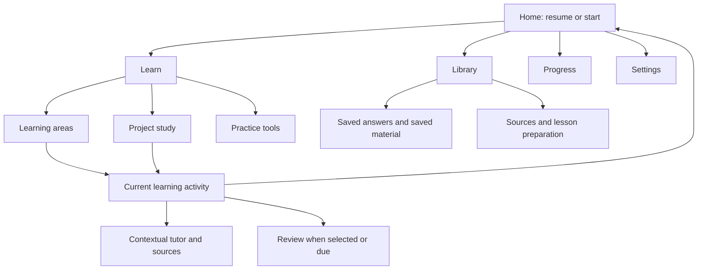

# Proposed information architecture — Phase 5

2026-10-04. Proposal grounded in the [product inventory](PRODUCT-UNDERSTANDING.md), [running audit](UX-AUDIT.md), [heuristic review](HEURISTIC-REVIEW.md) and [persona walkthroughs](LEARNER-PERSONA-TESTS.md). Current route definitions rechecked in `frontend/src/app/App.tsx`. This is a conceptual/navigation proposal, not implemented navigation or a claim of validated comprehension.

## The learner's conceptual model

Choose something to understand, continue one activity, ask for help in that context, and return to saved work. Materials supply evidence; an activated lesson is a learning activity; a saved answer is a prior conversation result; a notebook is executable work. These are related but not interchangeable. A learning area connects sources across courses; courses remain provenance and project organization, not a forced learning boundary.

An existing session retains its target. Choosing a target for a new session must not silently retarget the existing session or substitute an unrelated lesson for an empty area. Explain unavailable lessons and offer preparation or another explicit selection. Represent the effective target once in the start area, with optional scope details. Keep existing area/course precedence in the backend until a separately reviewed policy change is justified.

## Proposed top-level destinations

Use five task-oriented groups, with Home as the existing landing destination. Labels are candidates to test in the later prototypes, not new route contracts.

| Destination | Learner question | Contents and evidence basis |
|---|---|---|
| **Home** | What can I continue now? | Topic-named Resume first when available; otherwise choose/start an available lesson. New-session options separate from the current checkpoint. Addresses A/E re-entry and HR-11. |
| **Learn** | What do I want to understand or practice? | Learning areas, Project study, Practice tools (coding playground, audio visualizer), Vocabulary and Together. These remain distinct activities with explicit labels; do not put every tool on the initial learning screen. Addresses competing entry points without deleting capabilities. |
| **Library** | Where is what I saved or imported? | Saved answers, saved material labels, source materials and lesson drafts. Distinct typed destinations and storage explanations; no promised unified search engine. Addresses HR-08/09. |
| **Progress** | What evidence shows what I can do? | Existing skill map, contextual assessment evidence and session recap. Distinguish activity count, competency estimate and review schedule. No new scores or achievement system. HR-01 investigation remains prerequisite to stronger mastery claims. |
| **Settings** | How do I configure learning and services? | Preferences, Models/services and Experiments as an advanced subsection. Adaptation history stays discoverable here and reasons remain accessible in context. HR-02/05/10. |

Groups may initially be existing-link disclosures rather than five new landing pages. Do not build empty destination pages merely for symmetry. A library group is a navigational organization, not a database merge. Review remains a contextual learning activity and due-work entry, not a sixth permanently competing global destination. Preserve a direct review address and existing plan behavior.

This diagram describes discovery and context, not new backend transitions. The server checkpoint still decides session, review and recap routing.

## Complete existing-route mapping

Keep paths, answer IDs, query parameters and deep links working. Group selection is presentation only; a route change must not implicitly submit an answer, change a topic or end a session.

| Existing path | Proposed home / label | Preservation requirement |
|---|---|---|
| `/` | Home | Named resume before separate new-session controls; distinguish checkpoint read failure from no session. |
| `/areas` | Learn → Learning areas | Editable cross-source areas, source inspection, drafting and explicit activation retained. Preserve selected area query. |
| `/programs` | Learn → Project study | Understand/Try/reasoning, task focus, notebooks, files, checks and return flow retained. |
| `/playground` | Learn → Practice tools → Code playground | Standalone code and contextual tutor remain accessible without a course. |
| `/playground/visualizer` | Learn → Practice tools → Audio visualizer | Existing Watch/Learn/Create and sound/motion consent retained; do not bury it beneath code-only terminology. |
| `/vocab` | Learn → Vocabulary | Deck authoring and practice preserved; not conflated with skill-map review. |
| `/together` | Learn → Together | Keep accurate description of the existing feature; do not imply a human companion. |
| `/session` | Learn → Current activity | Entry follows authoritative checkpoint, preserving recovery identities and work. |
| `/review` | Learn → Review | Direct route and due-review entry retained; optional confidence and explicit scheduling ratings unchanged. |
| `/recap` | Contextual session recap; discoverable through session flow | Preserve ended-block versus ended-session distinction and any unsaved local fields. Do not invent a durable historical recap index. |
| `/answers` | Library → Saved answers | Search, scope, feedback and previous-answer reuse controls retained. |
| `/answers/:answerId` | Library → Saved answer | Preserve exact ID and origin/return context; do not reset active work on return. |
| `/corpus` | Library → Source materials | Import, job status/stop/resume, source inspection and advanced retrieval/trust controls retained through disclosure. |
| `/curriculum` | Library → Lesson drafts | Editing, provenance, review/proposal/activation remain separate actions; opening a draft never publishes it. |
| `/map` | Progress → Skill map | Prerequisites/evidence remain accessible; provide existing text information alongside visualization. |
| `/preferences` | Settings → Learning and accessibility | Group presentation by task; preserve values, timing, ownership and trial semantics. |
| `/models` | Settings → Models and services | Readiness, routing, budgets and model controls retained; service errors linked here from affected action. |
| `/experiments` | Settings → Advanced → Experiments | Definitions, assignments and lifecycle retained; no hidden participation or new experiment enrollment. |
| Unmatched path | Page not found | Existing understandable error and Home link retained. |

Saved material labels currently live on Home and should remain reachable there while Library provides a consistent secondary entry. A later relocation needs preservation of label/Undo/revisit behavior; it must not present a bookmark as a grade. Parking remains optional capture, reachable without covering content; relocate its affordance only after testing scroll/focus behavior.

## Learning-screen hierarchy

| Layer | What belongs here | Visibility rule |
|---|---|---|
| Essential | Current topic; current activity; explanation/question/work; primary next action; pause; relevant save/system status | Visible without opening a general tools menu. The question must retain enough context to answer. |
| Contextual | Hint, explain first, simpler/detail/example; source citations; correction/reporting; answer feedback; notebook run/check/return; active audio controls | Adjacent to the work they affect. Expose relevant choices; preserve free-text follow-up. Error recovery takes precedence when required. |
| Optional | Full session plan, time/energy details, representation choices, detailed numerical evidence, previous answers, saved notes | Named disclosures with state retained where appropriate. Do not move essential help behind several nested panels. |
| Advanced | Model diagnostics, retrieval/debug details, experiment administration, trust and import settings | Accessible through a relevant details link or Settings/Library; not part of the main answering path. |

The existing global LearningCompanion and local tutor must name their target. A page-level explanation must not masquerade as a continuation of a lesson-specific conversation. Do not duplicate chat histories or introduce a second client learning kernel to unify appearance.

### What stays reachable throughout learning

- **Topic and phase:** a compact orientation line using learner-facing terms, not raw `teach`/internal keys. Full course/source context remains inspectable.
- **Pause and help:** available in the current activity; End session and Change topic remain explicit alternatives with consequences. Pause preserves place, not elapsed time.
- **Progress:** concise activity position when useful; competency evidence separately available. Never replace the unresolved metric design with an arbitrary completion percentage.
- **Saved state:** distinguish browser draft, server checkpoint, saved answer, checked code snapshot and applied learning result. Show scope when it changes the learner's decision, not a permanent paragraph of implementation details.
- **Audio:** when playing/recording, visible stop/pause, volume/speed and status; when idle, a compact labelled entry. Never autoplay after resumption. Source-specific controls remain available, while avoiding duplicate expanded panels. Respect local voice routing and sensory preferences.
- **Navigation:** a compact predictable route out, plus return to the same activity. On narrow screens use existing responsive/disclosure patterns with keyboard access; avoid floating controls over text or focus targets.

### What should not compete with the task

New-session target selectors during an active lesson; a full model registry; unrelated import/draft controls; a flat list of all preference values; expanded global and local audio panels together; repeated generic instructions after their purpose is understood. Keep these discoverable rather than deleting them. Proposals should not steal focus or block resume; show the reason and choices without automatically applying them.

## Transition and state rules

| Intent | Navigation behavior | State safeguard |
|---|---|---|
| Resume | Return to server-owned current block and its existing content | Do not regenerate merely because the route reopened; recover existing request/result where available. |
| Ask for help | Keep current topic/question/notebook step visible | Bind explanation to the selected target and preserve unfinished answer. |
| Inspect source or saved answer | Open a contextual view with an explicit return | Preserve source identity, caller context and draft; Back is navigation, not undo. |
| Change preference | Make save/effect scope understandable | Inspect whether it applies now, next session or as a trial before promising timing. No silent replan. |
| Change topic | Disclose current session consequence and offer a way to pause instead | Preserve current single-session lifecycle; multi-session history is separate architectural work. |
| Finish practice | Show actual checked/submitted outcome and next available action | A code run, learner explanation, review rating and project completion are different outcomes. |
| Failed read/write | Show failure or uncertain outcome, with contextual recovery | Never replace cached content with false empty state; never infer no server change from a missing reply. |

## Validation before implementation

Use the same tasks across the later three visual directions: locate a prior answer; resume an interrupted lesson; get a hint without losing an answer; mark known material and choose what follows; find a notebook and return checked results; inspect why a suggestion appeared; change text size and return. Count decisions and steps, inspect active context and storage wording, and ask the owner to identify what happens next without secondary instructions.

Check all mapped routes and capability links, selected navigation, document titles/headings, focus return, keyboard disclosure, Back/Forward, mobile/zoom/reduced motion and read/write failures. Verify no new server learning writes occur from moving among navigation groups. Test the Park overlap with real scrolled viewports. Observe adaptation effect timing rather than assuming the visible controls work.

Unresolved: owner comprehension of proposed group names; final location of Together; whether a direct read-only lesson revisit is desirable; metric semantics; true delayed-return recall. These do not justify creating new infrastructure now. The next incomplete phase is Phase 6: document the existing design-system foundation and fill evidence-backed gaps. Visual directions and production implementation remain later phases.

## This phase's verification

Reconciled every explicit route in the current App with the table, including saved-answer detail and unknown-path recovery. Checked proposal against existing checkpoint, draft, local voice and assessment safeguards. Local document links and publication sanitation checked. No runtime behavior changed or new usability pass claimed; Phase 4 screenshots and tests remain the observational basis, not proof this proposed architecture is already usable.
